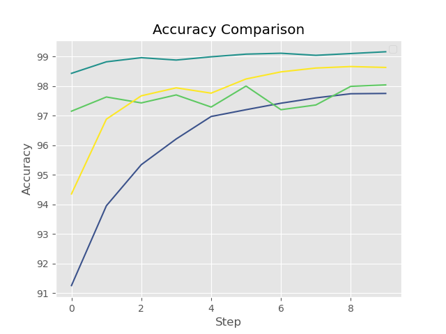
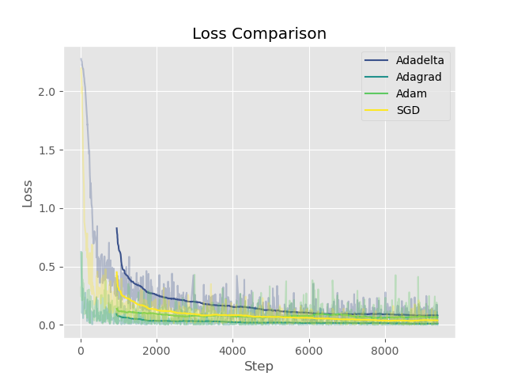
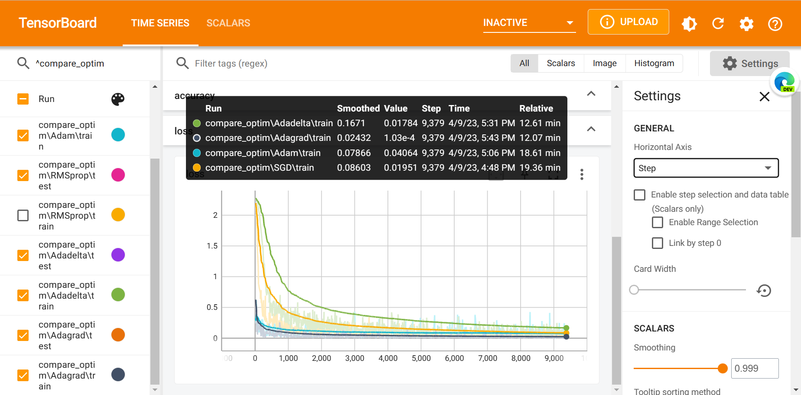
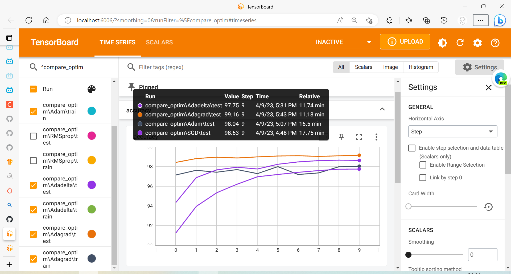
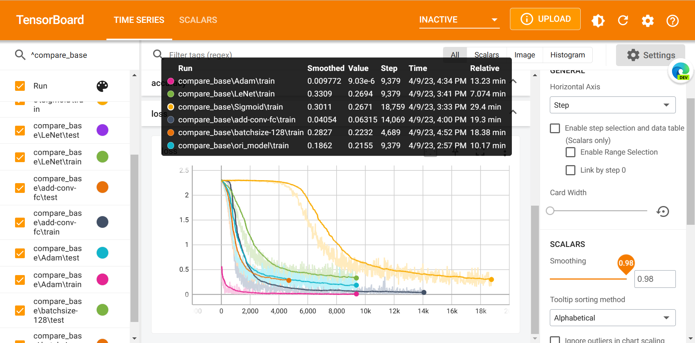
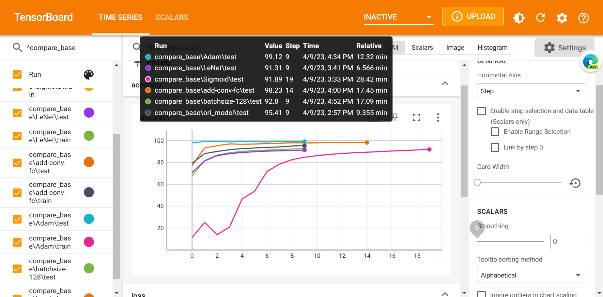

# 手写体数字识别 （Pytorch完成）

## 具体要求

- 网络结构：不同激活函数，不同的层数，每一层不同的神经元
- 优化方法：不同优化方法
- 如果GPU允许，改变不同batch_size

调整上述不同的结构，对ACC的影响，以及损失函数的
变化的曲线图和自己的分析。

## TL;DR 结论和展示

### 优化器
在我定义的卷积神经网络上，优化器的效果从差到好依次为：Adagrad < Adam < SGD < Adadelta。










采用**Adam**优化器显著提升模型效果，**增加网络深度**在增加训练轮数的条件下也能提升模型效果。

### 超参数分析
经过更改超参数，将batch size从64增加到128，从训练过程中的loss变化角度来看，可以观察到微小的提升。这是因为增加batch size可以减少训练迭代次数，提高训练效率，从而加快模型的收敛速度。然而，从验证集上的准确率结果来看，却发现性能下降了。这可能是由于增加batch size导致的过拟合问题。当batch size增加时，每个batch中的样本数目增多，可能会导致模型过度学习训练数据，从而发生过拟合。另外，增加batch size也会增加模型的内存需求，可能会导致内存不足而影响模型性能。因此，在选择batch size时，需要平衡训练效率和模型性能，并根据具体情况进行调整。

### 模型架构分析
使用Sigmoid激活函数会导致**梯度消失**问题，这会使得模型在训练过程中无法有效地学习，从而限制了模型的性能。相比之下，ReLU和其变种激活函数具有更好的性能和稳定性。

增加卷积层数可能会导致**过拟合问题**，尤其是在训练数据较少的情况下。这是因为过多的卷积层会导致模型过于复杂，容易记住训练数据中的细节，而无法泛化到新的数据。

因此，在设计深度学习模型时，需要仔细考虑激活函数和网络结构的选择，避免出现梯度消失和过拟合等问题。同时，也需要通过合适的正则化方法和数据增强技术等手段来提高模型的泛化能力。





## 代码说明

根据任务，分为比较优化器（`compare_optim.py`）和更改网络架构、超参数的模型比较（`run.py`）

- 构建dataloader使用`dataloader.py`

- 模型定义使用`model.py`

- 训练和验证使用`train.py`和`evaluate.py`

- 可视化等使用`utils.py`
  - 因网络问题无法上传至tensorboard dev中，最后用`plot.py`完成符合要求的对比图

其他文件夹的说明

- 数据保存在`/data`文件夹

- 训练记录保存在`/logs`文件夹

- 可视化的折线图保存在`/result`文件夹

- 从tensorboard下载的数据保存在`/tmp`文件夹


### 快速开始

```shell
python run.py
```

### 可视化
训练过程中运行下面的代码可以实现可视化

```shell
tensorboard --logdir ./logs
```

要想利用tensorboard保存的数据绘制loss和acc曲线，首先要将log文件夹上传到 TensorBoard.dev。

```shell
tensorboard dev upload --logdir ./logs
```
再运行`utils.py`中的`plot_loss_acc`函数即可。需要传入实验的编号（如`k2BUjrGBRWm8KkuayjqYXQ`）

运行`plot.py`亦可

这是我上传的实验链接~

`compare_base`: [base_link](https://tensorboard.dev/experiment/k2BUjrGBRWm8KkuayjqYXQ/)

`compare_optim`: [optim_link](https://tensorboard.dev/experiment/23g5u8JpQGGZNxGoZmECGg)

因为科学上网不稳定的问题，里面很多数据传输有问题(T_T)

### ipynb版代码

`mnist_exp.ipynb`文件是在colab中可以成功运行，本地环境配置可能会有些麻烦（如tensorboard等）

## 调试心得

1. 在修改网络结构时，更换激活函数和增加网络深度都导致了模型loss下降减缓，需要增加epoch和增大学习率来缓解。
猜想原因：1)Sigmoid适合二分类而非多分类。2)在网络深度增加时，产生了梯度消失等问题
2. tensorboard每次运行新的进程要删掉之前的，否则会导致曲线扭曲（因为混杂了之前的进程）
3. cpu中num_worker为0！否则报错：
```text
RuntimeError: DataLoader worker (pid(s) 23200) exited unexpectedly
```
接下来是一些代码讲解（大多数内容在ipynb文件中写得更清楚）

## 1. 准备数据集

首先，我们需要准备手写数字数据集，使用MNIST数据集，Pytorch已经提供了该数据集的下载和加载。


dataloader中images的shape为(64, 1, 28, 28)，表示有64张大小为28x28的灰度图像，labels的shape为(64,)，表示有64个标签。

这个过程由`dataloader.py`中的`build_dataloader`函数完成。

## 2. 定义卷积神经网络

接下来，定义一个卷积神经网络模型，包含两个卷积层、两个池化层和两个全连接层。其中，激活函数采用ReLU，优化方法采用SGD。

- nn.Conv2d：卷积层，输入为1个通道，输出为32个通道，卷积核大小为3x3。（nn.Conv2d(1, 32, 3)）
- nn.MaxPool2d：池化层，输入为2x2的窗口大小，步长为2，对输入进行最大池化操作。（nn.MaxPool2d(2, 2)）
- nn.Linear：全连接层，输入大小为64x5x5，输出大小为128。（nn.Linear(64 * 5 * 5, 128)）

维度解释：

假设输入图片大小为28x28，经过第一次卷积层后，输出大小为26x26x32（32是卷积核数量）。然后经过第一次池化层，输出大小为13x13x32。接着经过第二次卷积层，输出大小为11x11x64。再经过第二次池化层，输出大小为5x5x64。因此，经过这些层后，特征图的大小为5x5x64，即64个5x5的特征图。所以，全连接层的输入大小即为64x5x5，输出大小为128。

```
Net(
  (conv1): Conv2d(1, 32, kernel_size=(3, 3), stride=(1, 1))
  (pool1): MaxPool2d(kernel_size=2, stride=2, padding=0, dilation=1, ceil_mode=False)
  (conv2): Conv2d(32, 64, kernel_size=(3, 3), stride=(1, 1))
  (pool2): MaxPool2d(kernel_size=2, stride=2, padding=0, dilation=1, ceil_mode=False)
  (fc1): Linear(in_features=1600, out_features=128, bias=True)
  (fc2): Linear(in_features=128, out_features=10, bias=True)
  (relu): ReLU()
)
```

模型定义在`model.py`中，分别定义了四个网络，用于比较不同网络架构对模型训练的影响

- 简单的卷积神经网络模型（Net）
- LeNet模型（LeNet）
- 使用Sigmoid激活函数的卷积神经网络模型（NetSigmoid）
- 深层卷积神经网络模型（NetDeep）

## 模型训练和评估

这个过程由`train.py`/`evaluate.py`中的`train`/`evaluate`函数完成。

在训练过程中可以实时观察loss变化趋势，便于及时调整参数，修改模型架构。


## 修改超参数、网络结构、优化方法，观察模型效果

我们可以尝试修改超参数，比如改变激活函数、改变层数、改变神经元个数、改变优化方法、改变batch_size等，然后观察模型在测试集上的准确率和损失函数的变化。

也即用到在model中定义的四个网络，观察模型效果的变化。